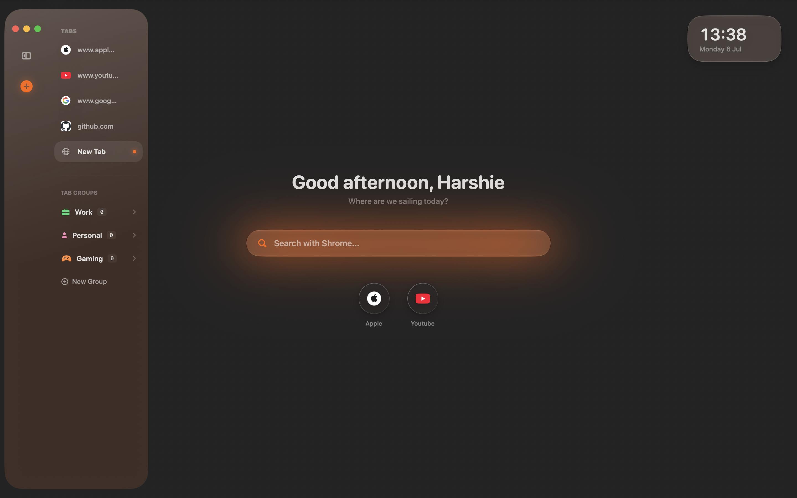

# Shrome 🌊

A native macOS browser built with SwiftUI and WebKit, with a Liquid Glass interface, built-in ad blocking, and a genuinely customizable new-tab experience.



## Features

**Browsing**
- Tabs and tab groups, with per-group color/icon customization
- Private browsing windows, optionally locked behind Touch ID
- A pooled WebView architecture that keeps tabs warm for fast switching
- Full browsing history, searchable, with per-item delete and a one-tap "Clear All Data"

**Built-in ad blocking**
- Native `WKContentRuleList`-based blocking for ads, trackers, and known ad-serving domains
- A dedicated YouTube ad-skip script that auto-clicks skip buttons and fast-forwards video ads
- Toggleable from Settings, with live updates across already-open tabs

**A new-tab page that's actually yours**
- Custom background image support
- Editable favorites, with one-tap add/remove from any page
- Time-aware greeting, personalized with your name
- 30 built-in color themes, plus a custom accent color picker

**Design**
- Built on macOS's Liquid Glass design language (`.glassEffect`), with real vibrancy — not a flat tint — so the interface adapts to whatever's behind it, the same way Safari's own chrome does
- Light / Dark / System appearance modes
- Fluid, spring-based animations throughout

**Privacy controls**
- Toggle tracker blocking, history saving, and search suggestions independently
- Configurable startup behavior: resume your last session, open a fresh tab, or jump to a specific tab group
- Choice of search engine: Google, Bing, DuckDuckGo, Brave Search, or Ecosia

## Requirements

- macOS 26 (Tahoe) or later — the Liquid Glass APIs this app is built around aren't available on earlier versions
- Xcode 26 or later to build from source

## Getting Started

```bash
git clone https://github.com/harshbhavesh-shah/Shrome.git
cd Shrome
open Shrome.xcodeproj
```

Build and run (`⌘R`) from Xcode. No external dependencies or package managers required. Everything is built on native SwiftUI, AppKit, WebKit, and Core Data.

## Project Structure

```
Shrome/
├── ShromeApp.swift               # App entry point, menu commands, window scenes
├── ContentView.swift              # Root view, appearance handling, window chrome
├── BrowserView.swift              # Tab content switching (landing page vs. web content)
├── TabModel.swift                 # Tab/TabGroup models, TabManager (navigation, session, history)
├── WebViewPool.swift               # Pooled WKWebView management + ad-block wiring
├── AdBlocker.swift                 # Content rule list + YouTube ad-skip script
├── SidebarView.swift                # Tab list, tab groups, window controls
├── GravityLandingView.swift         # New-tab page (favorites, greeting, background)
├── FloatingAddressBar.swift         # In-page address bar
├── HistoryView.swift                # Browsing history panel
├── GravityPreferencesView.swift     # Settings window
├── Theme.swift                      # Color themes, animations, shared styling
└── Persistence.swift                # Core Data stack
```

## Known Limitations

- macOS only — there's no iOS/iPadOS version yet. The core tab/navigation logic is written in a way that could support a future port, but the interface itself (menu bar commands, hover-based sidebar, window chrome) is designed specifically for macOS and would need a separate iOS-native UI built around touch.

## Changelog

See [Releases](../../releases) for version history. Latest: **[1.1.0](../../releases/tag/1.1.0)**.

## License

This project is licensed under the [MIT License](LICENSE).

## Acknowledgments

Built by [Harsh Shah](https://github.com/<your-username>).
