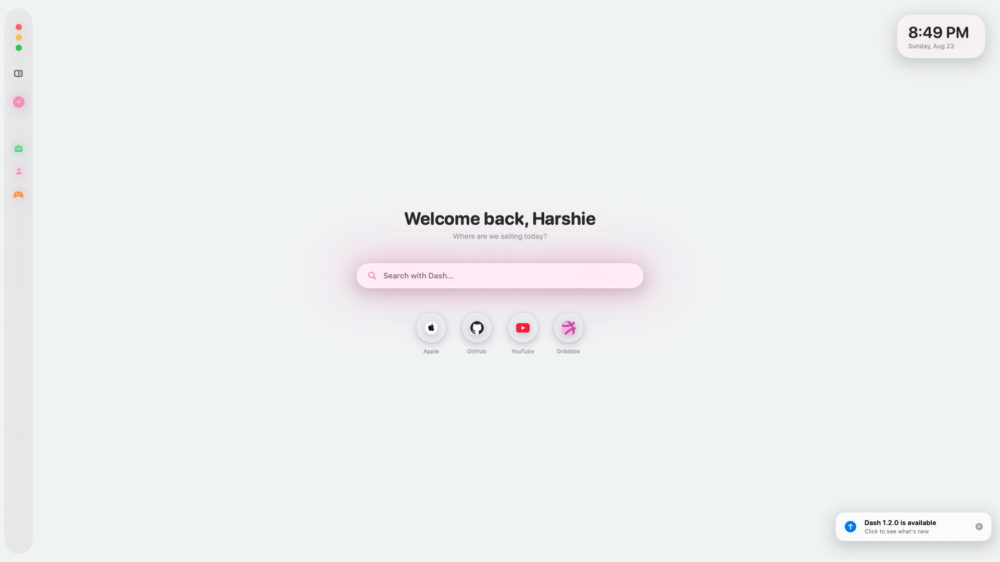
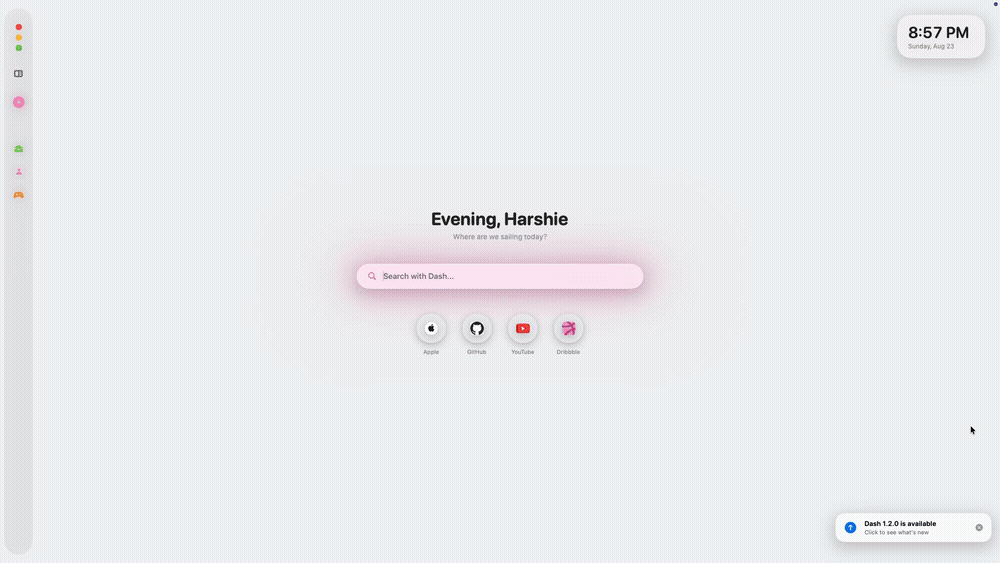
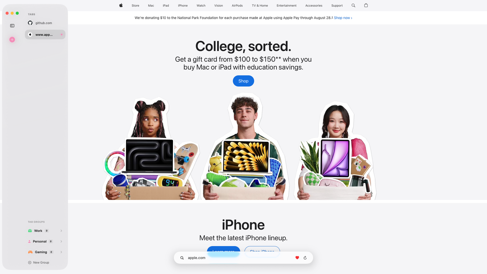

<div align="center">

# Dash 🌊

**A native macOS browser, built with SwiftUI and WebKit.**

Liquid Glass everywhere, built-in ad blocking, and a new-tab page that's actually yours.

[](https://www.apple.com/macos/)
[](https://swift.org)
[](LICENSE)
[](../../releases)

[**dashbrowser.in**](https://dashbrowser.in) · [Releases](../../releases) · [Issues](../../issues)

</div>

<div align="center">



*The new-tab page — greeting, favorites, and the search bar mid-glow.*



*The search bar morphing into the floating address bar as a page loads.*



*Sidebar expanded — tabs, tab groups, and a page in progress.*

</div>

---

## What is Dash?

Dash is a from-scratch macOS browser — not a Chromium wrapper. It leans entirely on Apple's own frameworks (SwiftUI, AppKit, WebKit, Core Data) and macOS 26's Liquid Glass design language, with a hover-away sidebar, tab groups, a pooled `WKWebView` architecture for fast tab switching, and a new-tab page you can actually make your own.

Learn more or grab the latest build at **[dashbrowser.in](https://dashbrowser.in)**.

## ✨ Features

**Browsing**
- Tabs, tab groups (custom name/icon/color), and pinned tabs
- Reopen Closed Tab (`⇧⌘T`), Find in Page (`⌘F`), and a Quick Switcher (`⌘K`) that searches open tabs and history together
- Private browsing windows, optionally locked behind Touch ID
- A pooled `WKWebView` architecture that keeps tabs warm for fast switching
- Full browsing history, searchable, with per-item delete and a one-tap "Clear All Data"
- A download manager with a live progress shelf and a full downloads panel

**Built-in ad blocking**
- Native `WKContentRuleList`-based blocking for ads, trackers, and known ad-serving domains
- A dedicated YouTube ad-skip script that auto-clicks skip buttons and fast-forwards video ads
- Toggleable from Settings, with live updates across already-open tabs

**A new-tab page that's actually yours**
- Custom background image support
- Editable favorites, with one-tap add/remove from any page
- Time-aware greeting, personalized with your name
- 30 built-in color themes, plus a custom accent color picker

**Design**
- Built on macOS's Liquid Glass design language (`.glassEffect`), with real vibrancy — not a flat tint — so the interface adapts to whatever's behind it, the same way Safari's own chrome does
- Light / Dark / System appearance modes
- Fluid, spring-based animations throughout

**Privacy controls**
- Toggle tracker blocking, history saving, and search suggestions independently
- Optionally wipe history and website data automatically on quit
- Configurable startup behavior: resume your last session, open a fresh tab, or jump to a specific tab group
- Choice of search engine: Google, Bing, DuckDuckGo, Brave Search, or Ecosia

## ⌨️ Keyboard Shortcuts

| Action | Shortcut |
| --- | --- |
| New Tab | `⌘T` |
| New Window | `⌘N` |
| New Private Window | `⇧⌘N` |
| Close Tab | `⌘W` |
| Reopen Closed Tab | `⇧⌘T` |
| Find in Page | `⌘F` |
| Reload Page | `⌘R` |
| Toggle Sidebar | `⌃⌘S` |
| Quick Switcher | `⌘K` |
| Next Tab / Previous Tab | `⇧⌘]` / `⇧⌘[` (also `⌃Tab` / `⌃⇧Tab`) |
| Jump to Tab 1–8 | `⌘1` – `⌘8` |
| Jump to Last Tab | `⌘9` |
| Back / Forward | `⌘[` / `⌘]` |
| Show History | `⌘Y` |
| Show Downloads | `⌥⌘L` |

## 📋 Requirements

- macOS 26 (Tahoe) or later — the Liquid Glass APIs this app is built around aren't available on earlier versions
- Xcode 26 or later to build from source

## 🚀 Getting Started

```bash
git clone https://github.com/harshbhavesh-shah/Dash.git
cd Dash
open Dash.xcodeproj
```

Build and run (`⌘R`) from Xcode. No external dependencies or package managers required. Everything is built on native SwiftUI, AppKit, WebKit, and Core Data.

## 🗂️ Project Structure

```
Dash/
├── DashApp.swift                  # App entry point, menu commands, window scenes
├── ContentView.swift               # Root view, appearance handling, window chrome
├── BrowserView.swift                # Tab content switching (landing page vs. web content)
├── TabModel.swift                   # Tab/TabGroup models, TabManager (navigation, session, history)
├── WebViewPool.swift                 # Pooled WKWebView management + ad-block wiring
├── AdBlocker.swift                   # Content rule list + YouTube ad-skip script
├── WindowUtils.swift                 # WKWebView bridging, window chrome helpers
│
├── SidebarView.swift                 # Tab list, tab groups, window controls
├── TabGroupsDeckView.swift           # Tab group deck (expanded + collapsed)
├── FloatingAddressBar.swift          # In-page address bar
├── InlineCompleteTextField.swift     # Address bar's inline autocomplete text field
├── FindBarView.swift                 # Find-in-page bar
├── QuickSwitcherView.swift           # ⌘K command palette
│
├── GravityLandingView.swift          # New-tab page (favorites, greeting, background)
├── LiquidGlassClockPanel.swift       # New-tab page clock widget
├── GravityPreferencesView.swift      # Settings window
├── Theme.swift                       # Color themes, animations, shared styling
├── BackgroundImageStore.swift        # Custom landing-page background storage
│
├── HistoryView.swift                 # Browsing history panel
├── DownloadManager.swift             # WKDownloadDelegate, download tracking
├── DownloadShelfView.swift           # Live download progress shelf
├── DownloadView.swift                # Downloads panel
│
├── NameOnboardingView.swift          # First-run name prompt
├── UpdateChecker.swift               # GitHub-releases update checking
├── UpdateNotificationView.swift      # In-app update banner
├── HapticFeedback.swift              # Trackpad haptics
└── Persistence.swift                 # Core Data stack
```

## 🧭 Known Limitations

- macOS only — there's no iOS/iPadOS version yet. The core tab/navigation logic is written in a way that could support a future port, but the interface itself (menu bar commands, hover-based sidebar, window chrome) is designed specifically for macOS and would need a separate iOS-native UI built around touch.

## 📝 Changelog

See [Releases](../../releases) for version history. Latest: **[1.2.0](../../releases/tag/v1.2.0)**.

## 📄 License

This project is licensed under the [MIT License](LICENSE).

---

<div align="center">

**Made by [Harsh Shah](https://harsh.radiancelaser.in)**

[Portfolio](https://harsh.radiancelaser.in) · [Dash](https://dashbrowser.in)

</div>
